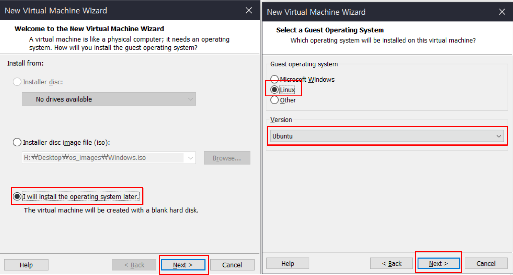
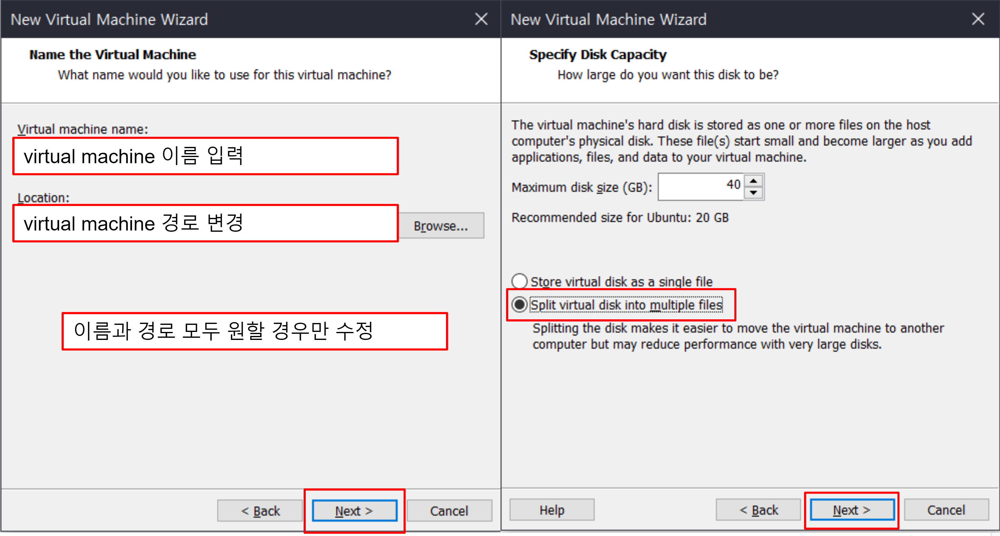
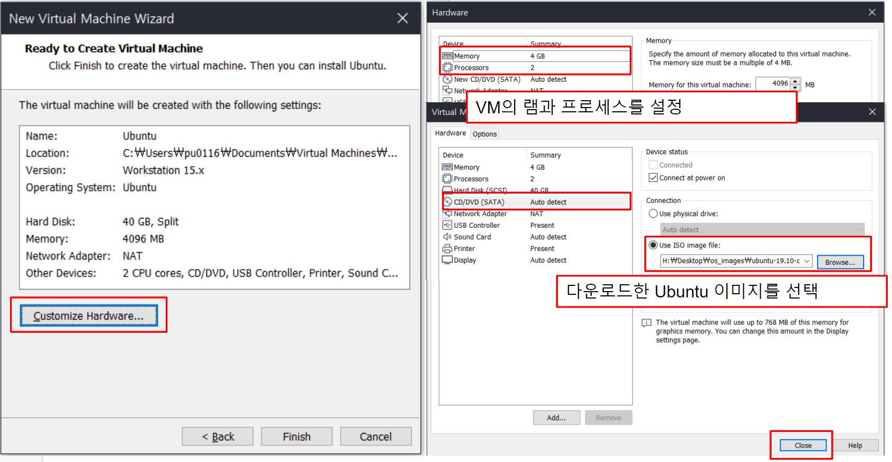
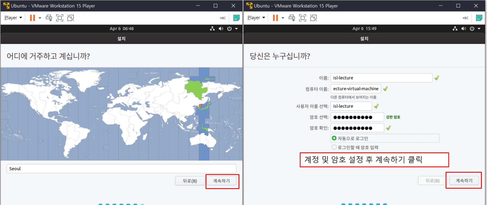
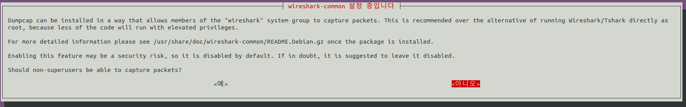
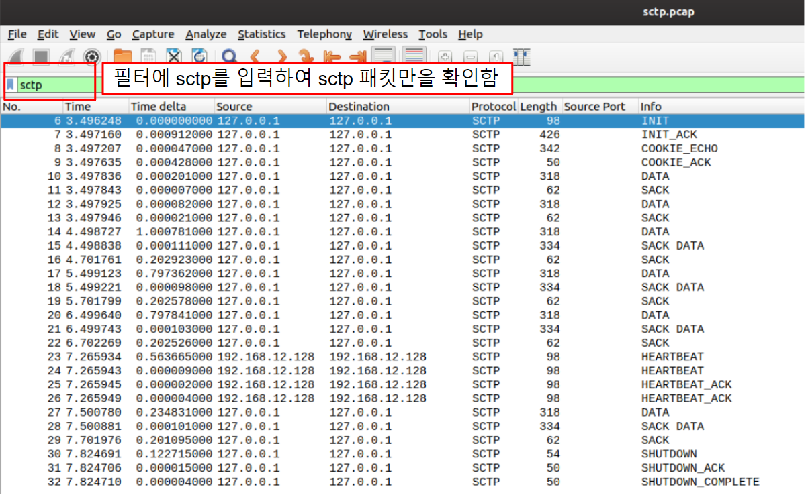
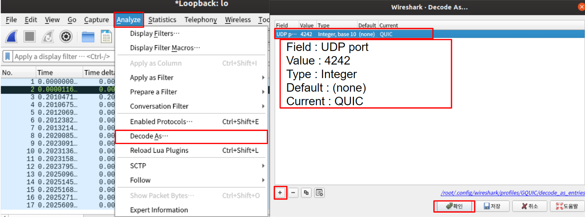

~~~
title : SCTP, QUIC, CoAP Packet Capture
~~~

# Installation of VMware

- Download and run the VMware workstation player installation file from https://vmware.com/kr.html

[VMware Download](https://vmware.com/kr.html)


# Installation of Ubuntu

## Download ubuntu image


## Create virtual machine








## Install ubuntu on VMware




# Installation of Wireshark

- Wireshark is a network packet capture and analysis tool

- There is Wireshark for Windows, but in this homework, we install Wireshark on ubuntu.

- You can install wireshark easily with command `sudo apt install wireshark` on ubuntu

  

- During installation, select No in the dialog window asking if you want to allow non-superusers to capture packets via wireshark.

  

# Installation of Git

- Install git by entering the following command in the terminal

    ```bash
    sudo apt install git
    ```

# Download Sample Files

- SCTP, QUIC, and CoAP packet transmission programs to be used in this homework have been uploaded in the bin directory of this repository.

- Download the sample program through the command below

  ```bash
  git clone https://github.com/iot-standards-laboratory/lecturehw.packetCapture.git
  ```

- Move to the bin directory in the downloaded git directory

  ```bash
  cd lecturehw.packetCapture/bin
  ```

  - There are 3 directories (sctp, quic, and coap) in the bin directory, and server and client sample program exist in each directory.

- Modify all executable file permissions in bin directory

  ```bash
  sudo chmod -R a+x *
  ```

# Wireshark 실행

- Run wireshark

  ```bash
  sudo wireshark
  ```

# Terminal 실행

- Open 3 terminals for server, client and wireshark

  

# SCTP Capture

## Move to sctp directory

- Go to the sctp directory in the bin directory

```
cd sctp
```

## Run sctp server

```bash
./server
```

## Run sctp client

```bash
./client
```

## Return to the bin directory

- Shut down the server and client, and move the working directory of each terminal to the bin directory

```bash
cd ..
```

# QUIC Capture

## Move to quic directory

- Go to the quic directory in the bin directory

```
cd quic
```

## Run quic server

```bash
./server
```

## Run quic client

```bash
./client
```

## Return to the bin directory

- Shut down the server and client, and move the working directory of each terminal to the bin directory

```bash
cd ..
```

# CoAP Capture

## Move to coap directory

- Go to the coap directory in the bin directory

```
cd coap
```

## Run coap server

```bash
./server
```

## Run coap client

```bash
./client
```

## Return to the bin directory

- Shut down the server and client, and move the working directory of each terminal to the bin directory

```bash
cd ..
```

# Packet Analysis 

- Stop the packet capture

  

## SCTP Analysis

- Enter sctp in the filter to analyze sctp packets



## QUIC Analysis

- Enter quic in the filter to analyze quic packets

  

- Depending on the version of Wireshark, in order to analyze QUIC, You have to configure the wireshark to decode a specific UDP port as QUIC.

- Since the 4242 port was used for the quic sample program used in this homework, you have to decode the UDP datagram using the 4242 port as QUIC.

  

## CoAP Analysis

- Enter coap in the filter to analyze coap packets

  

# Youtube Link 

- https://youtu.be/Q08rkugYsw8

# Sample Code Github Link

- Anyone interested in the code for the SCTP, QUIC, and CoAP samples can be found at the link below.
  - [SCTP](https://github.com/iot-standards-laboratory/samplecode.go-sctp)
  - [QUIC](https://github.com/iot-standards-laboratory/samplecode.go-quic)
  - [CoAP](https://github.com/iot-standards-laboratory/samplecode.go-coap)

