# Installation of VMware

- VMware workstation player 설치파일을 https://vmware.com/kr.html에서 다운로드하여 실행함

[VMware Download](https://vmware.com/kr.html)

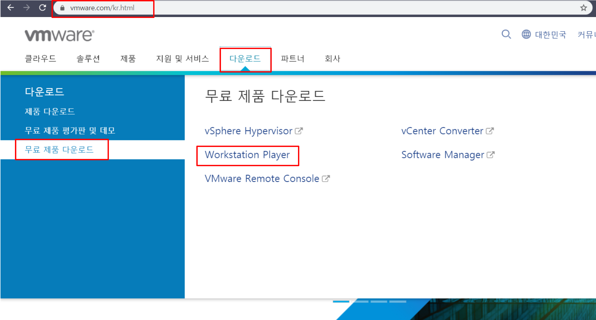

# Installation of Ubuntu

## Ubuntu Image 다운로드

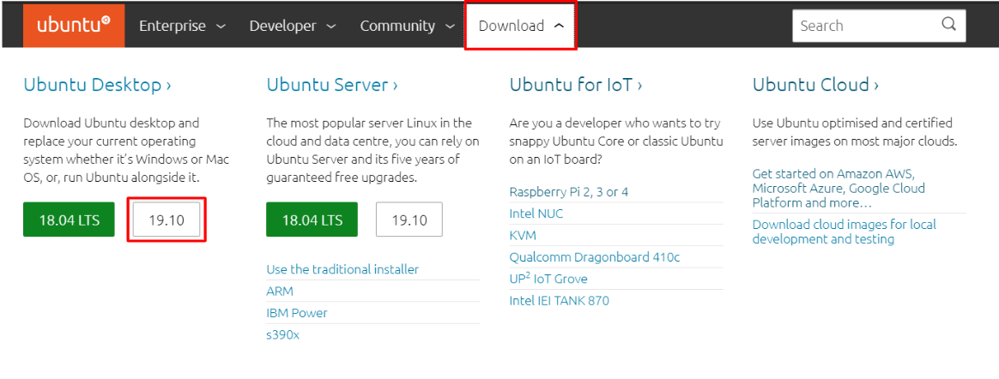

## Virtual Machine 생성

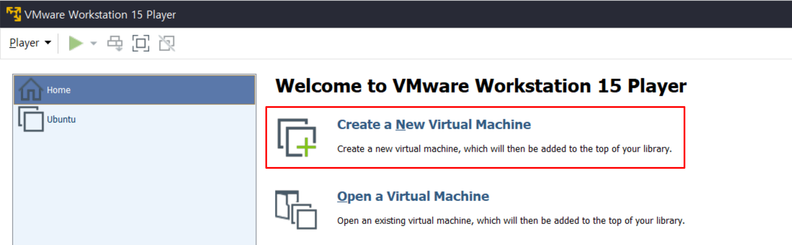

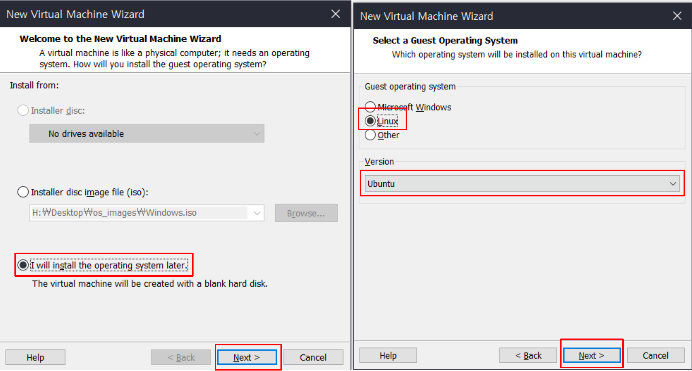

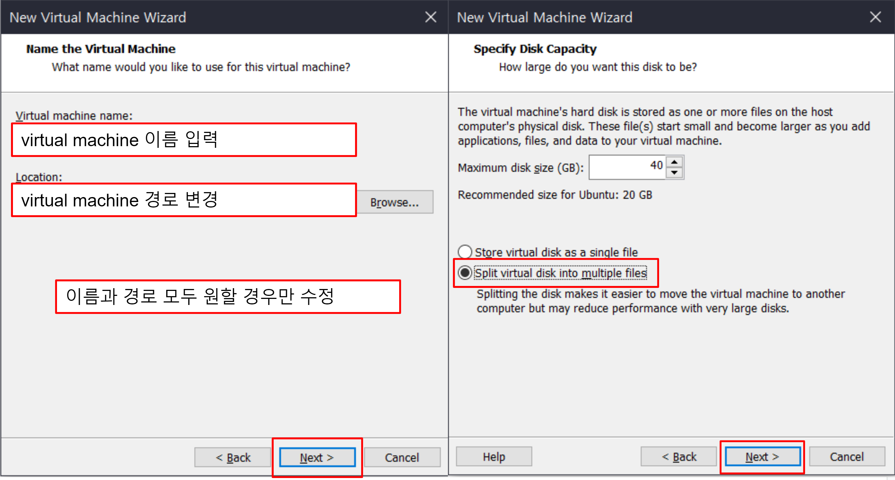

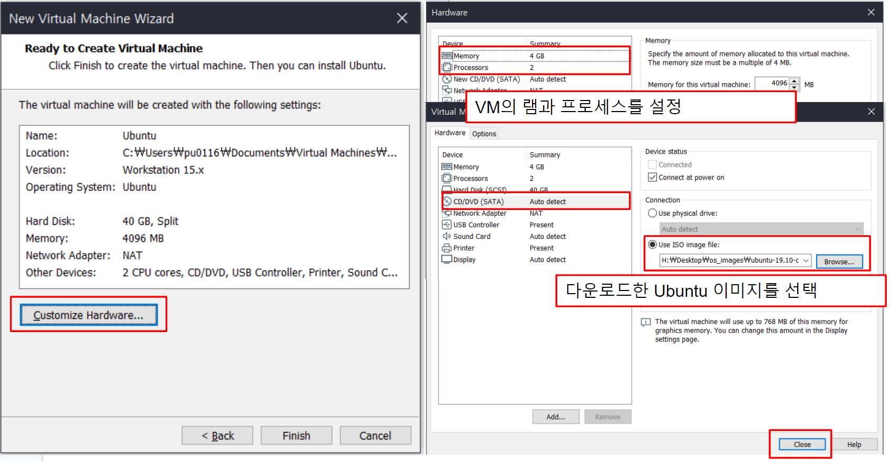

## VMware에 Ubuntu 설치

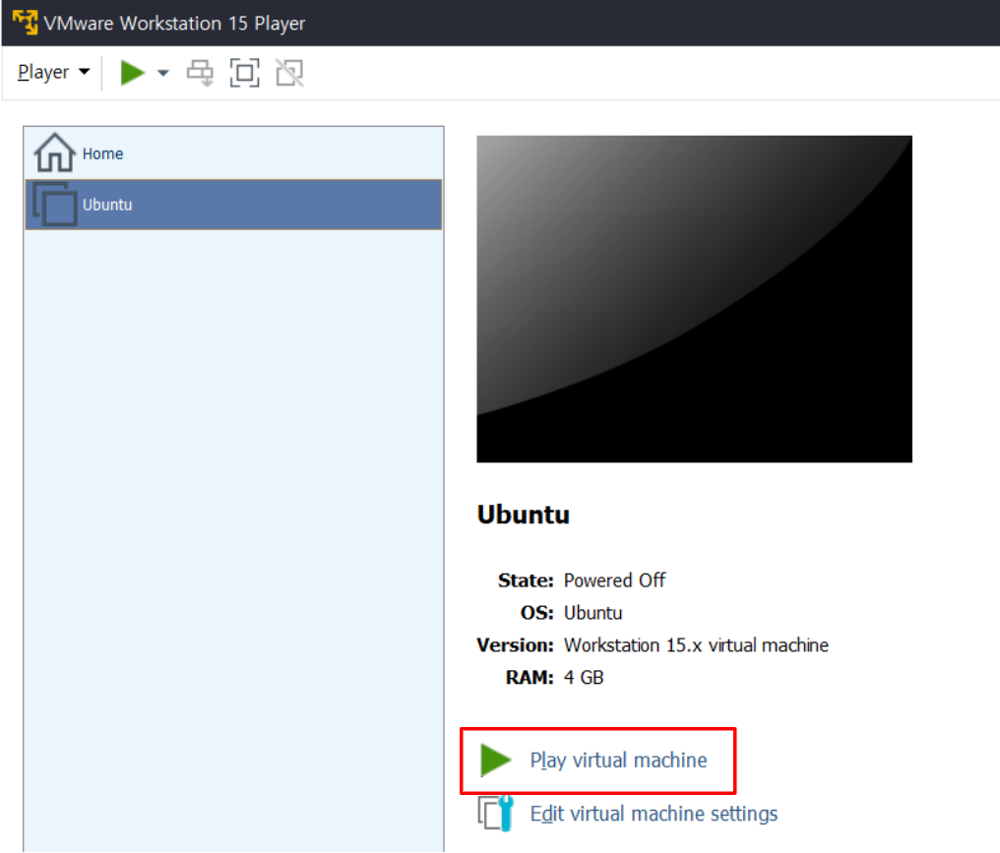

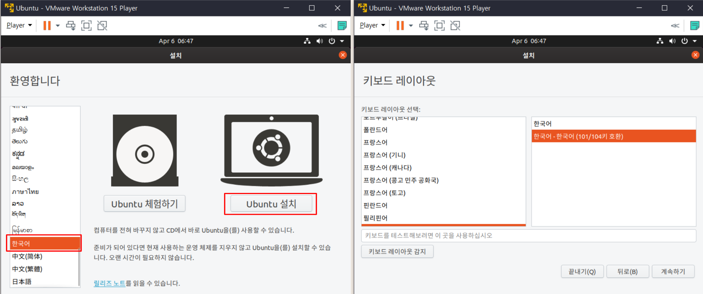

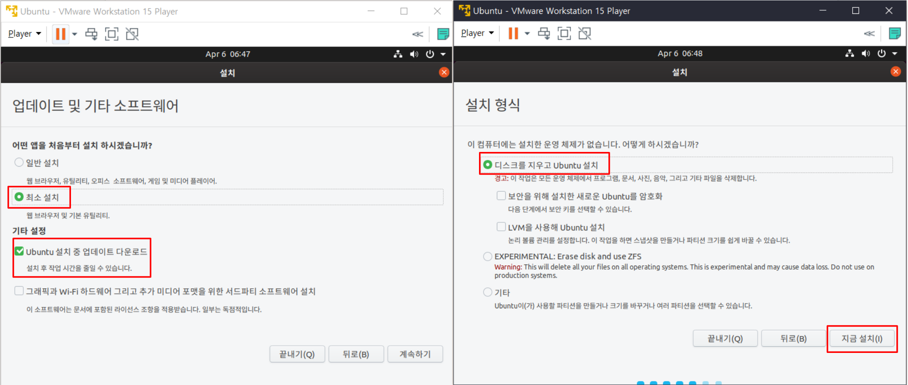

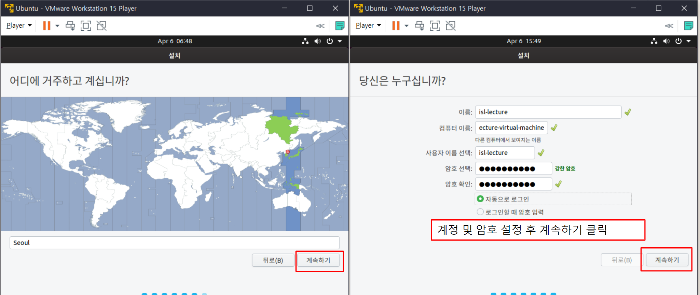

# Installation of Wireshark

- Wireshark는 네트워크 패킷 캡처 및 분석 도구임

- Wireshark는 windows에서 실행해도 되지만 이번 실습에서는 ubuntu에서 Wireshark를 설치함

- ubuntu에서는 터미널 실행 후 `sudo apt install wireshark` 명령을 통해 간단하게 Wireshark를 설치할 수 있음

  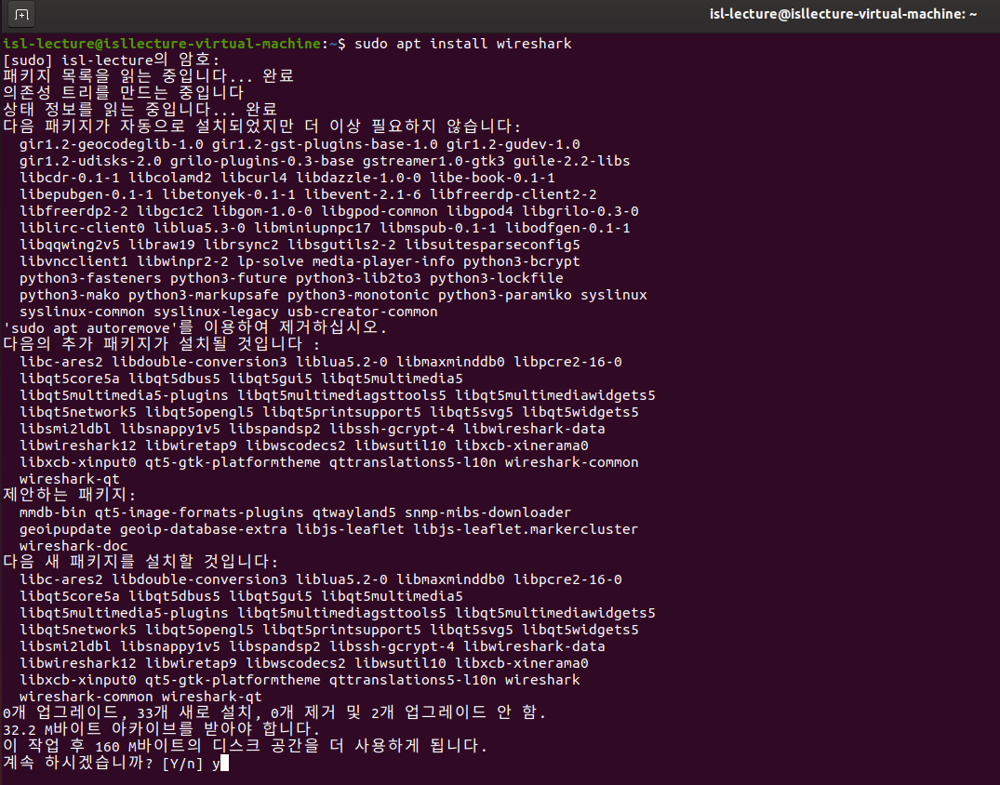

- 설치 중 non-superuser가 wireshark를 통해 패킷을 캡처할 수 있도록 할 것인지를 묻는 다이얼로그 창에서 아니오를 선택함

  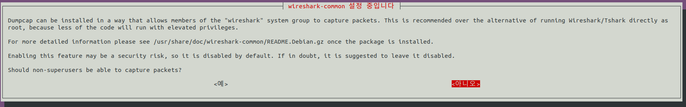

# Installation of Git

- 터미널에서 아래의 명령을 입력하여 git을 설치함

    ```bash
    sudo apt install git
    ```

# Download SCTP and QUIC sample

- 본 과제에서 사용할 SCTP 및 QUIC 패킷 전송 프로그램은 본 레포지토리의 bin 디렉터리에 올려두었음

- `git clone https://github.com/iot-standards-laboratory/lecturehw.sctp_quic_capture.git`를 통해 샘플 프로그램을 다운로드함

- 다운로드한 git 디렉터리내에 있는 bin 디렉터리로 이동함

  ```bash
  cd lecturehw.sctp_quic_capture/bin
  ```

- bin 디렉터리내에 있는 2개의 실행파일 권한을 수정함

  ```bash
  sudo chmod a+x *
  ```

# Wireshark 실행

- 터미널에서 wireshark를 실행함

  ```bash
  sudo wireshark
  ```

  

# SCTP Capture

## sctp server 실행

```bash
./sctp -server -port 9000
```

## sctp client 실행

```bash
./sctp -port 9000 -ip localhost
```


# QUIC Capture

- sample 프로그램을 실행하면 QUIC echo server를 실행한 후 echo client가  `ISL-Lecture.AdvancedMobileComputing`을 server에 전달함.
- 다음 명령어를 통해 quic sample 프로그램을 실행할 수 있음

```bash
./quic
```

# Packet Analysis 

- 패킷 캡처를 중지함

  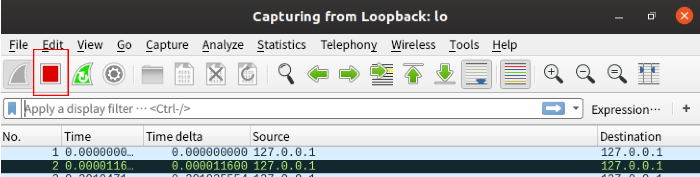

## SCTP Analysis

- 필터에 sctp를 입력하여 sctp 패킷을 분석함

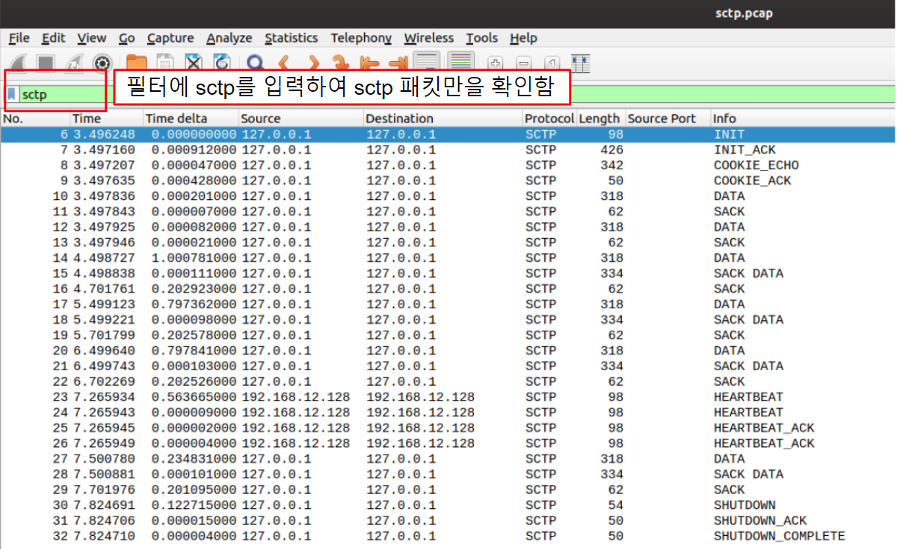

## QUIC Analysis

- QUIC을 분석하기 위해서는 특정 UDP 포트를 QUIC으로 Decode할 수 있도록 설정해야함

- 본 과제에서 사용하는 quic sample 프로그램은 4242 포트를 사용하였으므로, 여기서는 4242포트를 사용하는 UDP datagram을 QUIC으로 decode함

  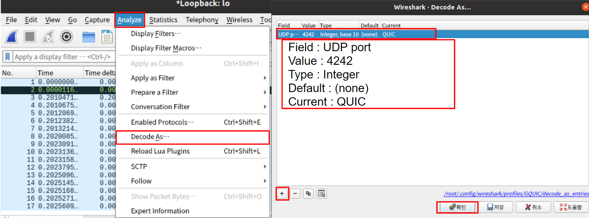

- 필터에 quic을 입력하여 quic 패킷을 입력함

  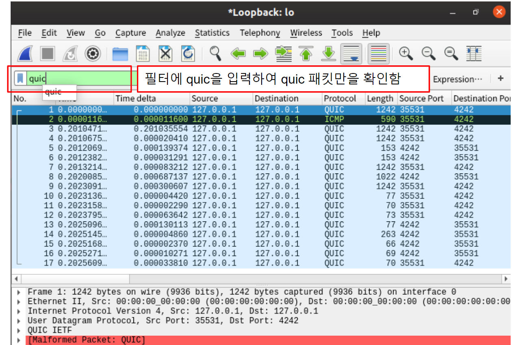